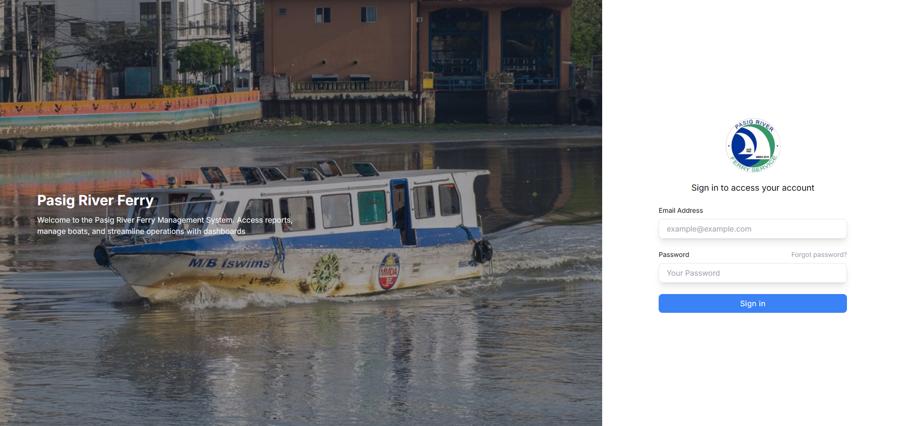
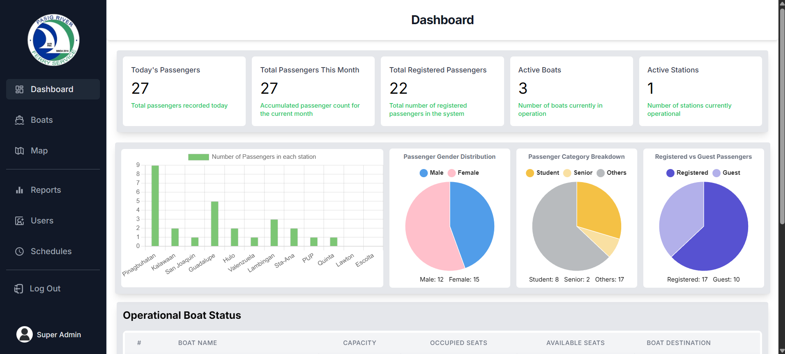
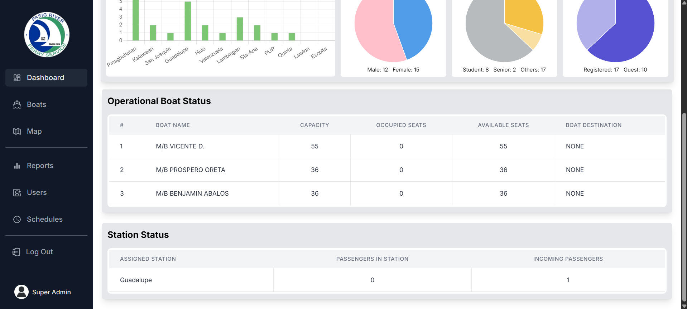
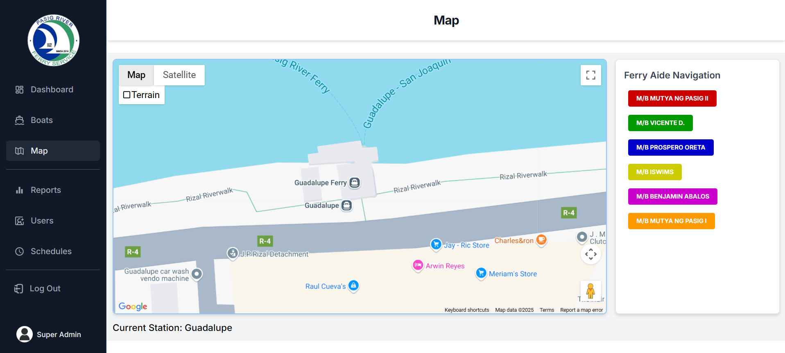
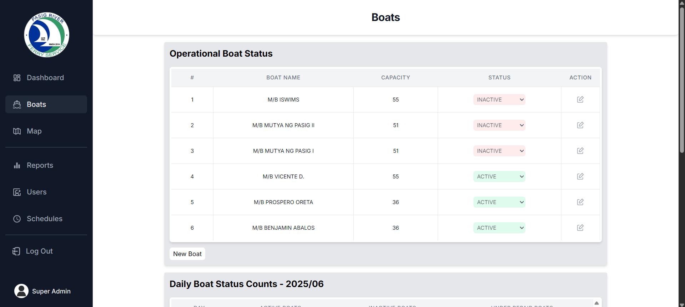
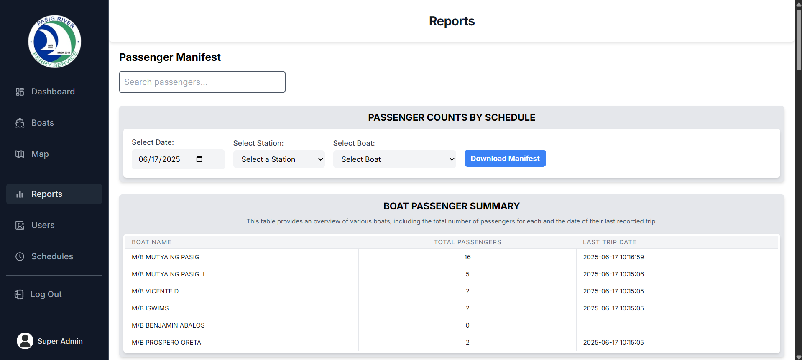
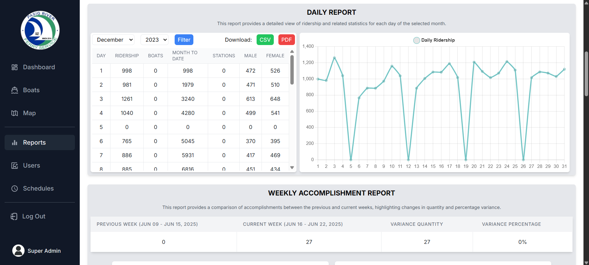
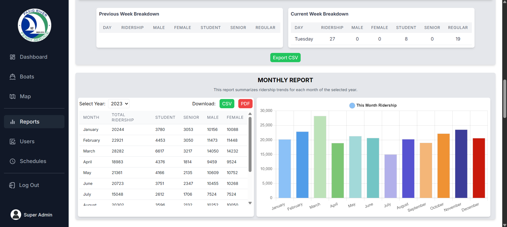
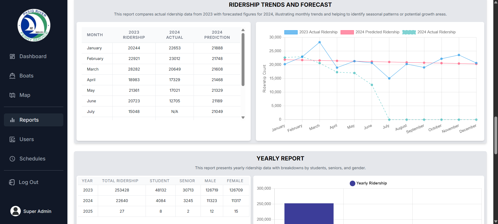

# 🚢 Pasig River Ferry Passenger Management Web App

The **Pasig River Ferry Passenger Management System** is a web-based application developed to automate and enhance the ferry operation and commuter experience in Metro Manila. This application serves as an administrative and operational platform for the **Pasig River Ferry Service (PRFS)** — improving ridership data accuracy, passenger manifest validation, and ferry tracking.

> 📱 This repository is for the **Web App** only. A separate mobile application is used by ferry aides, captains, and passengers.

---

## 🧰 Features

### ✅ Web App for Admins, Operators, and Boat Managers
- **User Roles**: Super Admin, Admin, Ferry Operator, and Boat Manager.
- **Login System** with forgot password functionality.
- **Passenger Dashboard**: Real-time counts, demographics, and ferry status.
- **Map Integration**: GPS-based tracking of ferry locations.
- **Boat Management**: Status updates (ACTIVE, INACTIVE, MAINTENANCE) and logs.
- **Descriptive Analytics**: Charts and tables showing daily, weekly, monthly, and yearly ridership data.
- **Downloadable Reports**: Export to CSV and PDF formats.

---

## 📊 Dashboard Metrics

- Today's Total Passengers
- Monthly Ridership Summary
- Active Boats & Stations
- Gender & Profession Breakdown (e.g., Students, Seniors)
- Passenger counts per station
- Comparison of Guest vs Registered passengers

---

## 🛠️ Tech Stack

| Technology      | Description                      |
|----------------|----------------------------------|
| Laravel         | Web backend framework (PHP)      |
| PostgreSQL      | Database                         |
| Tailwind CSS    | Frontend styling framework       |
| Blade Templates | Laravel's native templating engine |

---

## 📷 Screenshots

### 🔐 Login Page

### 📊 Dashboard Overview

### 🗺️ Ferry Map Tracking

### ⚙️ Boat Configuration Page

### 📈 Ridership Reports

---
